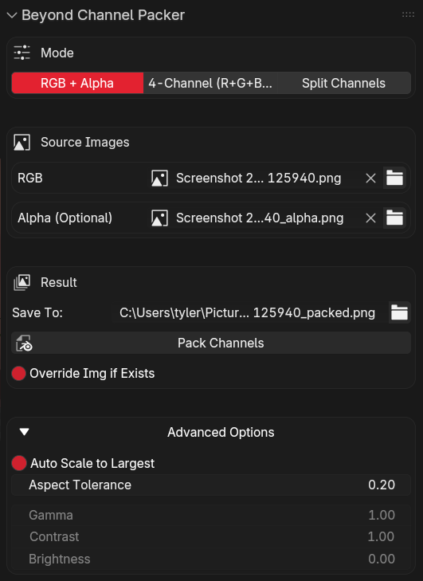

# Beyond Channel Packer (Blender)

Channel-pack textures directly in Blender’s Image Editor:

- **RGB + Alpha**: combine an RGB image + optional alpha mask into an RGBA output.
- **4-Channel (R+G+B+A)**: combine four separate images into RGBA (each image provides one channel).
- **Split Channels**: split a 3- or 4-channel image into separate channel images and save them.

## Issues / Support

Report bugs and request features here:
https://github.com/tdw46/BeyondChannelPacker/issues

## Install

- Copy this folder to your Blender extensions/addons location (or install as an extension).
- In Blender: `Edit > Preferences > Add-ons`, enable **Beyond Channel Packer**.

## Open The UI

- Go to the **Image Editor**.
- Open the **N-panel** (right sidebar) → **Channel Packer** tab → **Beyond Channel Packer**.

## Common Workflow (All Modes)

<table>
  <thead>
    <tr>
      <th align="left">Workflow</th>
      <th align="left">Panel</th>
    </tr>
  </thead>
  <tbody>
    <tr>
      <td valign="top">
        <ol>
          <li>Pick a <strong>Mode</strong> tab at the top.</li>
          <li>Set your <strong>Source Images</strong>.</li>
          <li>
            Set <strong>Save To</strong> (defaults to the first source image path +
            <code>_packed</code> / <code>_split</code>).
          </li>
          <li>
            Toggle <strong>Override Img if Exists</strong>:
            <ul>
              <li><strong>On</strong>: overwrite <code>Save To</code> exactly.</li>
              <li>
                <strong>Off</strong>: saves a unique filename if the target already exists
                (adds <code>_1</code>, <code>_2</code>, …).
              </li>
            </ul>
          </li>
          <li>Click <strong>Pack Channels</strong> (or <strong>Split Channels</strong> in Split mode).</li>
          <li>The saved output is written to disk and the Image Editor switches to the result.</li>
        </ol>
        
<strong>Notes</strong>

        <ul>
          <li>If a source image file is missing on disk, packing will error until you re-link/reload it.</li>
          <li>Packing uses straight alpha and writes the alpha values into the output file.</li>
        </ul>
      </td>
      <td valign="top">
        
      </td>
    </tr>
  </tbody>
</table>

## Mode: RGB + Alpha

- **RGB**: required.
- **Alpha (Optional)**: if provided, it is flattened to one greyscale channel and used as output alpha.
- Output is saved to `Save To` and shown in the Image Editor.

## Mode: 4-Channel (R+G+B+A)

- Provide any/all of **Red**, **Green**, **Blue**, **Alpha** images.
  - Missing color channels default to `0.0` (black).
  - Missing alpha defaults to `1.0` (opaque).
- Each channel input is treated as greyscale (if it’s RGBA, the greyscale comes from the
  “best” channel available for that image).

### Advanced Options (bottom, collapsed)

- **Auto Scale to Largest**: if inputs differ in size but have similar aspect ratios, they are
  resampled to the largest image.
- **Aspect Tolerance**: allowed aspect ratio difference for auto scaling.
- **Gamma / Contrast / Brightness**: optional output tuning for the 4-channel mode.

## Mode: Split Channels

- **Source**: one image with **3 channels (RGB)** or **4 channels (RGBA)**.
- **Output Names**:
  - Defaults to `<source>_red`, `<source>_green`, `<source>_blue`, `<source>_alpha`.
  - The Alpha name field only appears when the source has an alpha channel.
- Saves individual greyscale images (Non-Color) to the `Save To` folder with the chosen names.

## More From BeyondDev

- Stores:
  - SuperHive Market (Blender Market): https://superhivemarket.com/creators/beyonddev
  - Gumroad store: https://beyonddev.gumroad.com/
- Products (Gumroad):
  - CamKeys: https://beyonddev.gumroad.com/l/camkeys
  - Lattice Auto Weighting: https://beyonddev.gumroad.com/l/latticeautoweight
  - Beyond VRM Extension Suite: https://beyonddev.gumroad.com/l/vrm
